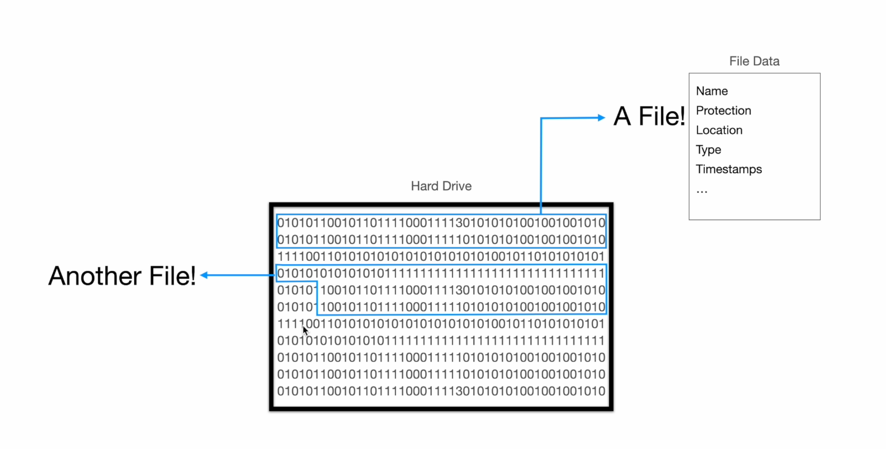

__File System__ 

What is File?  
File is a sequence of bits. It can be image file, video file or audio file, text file etc.

Everything inside your hard drive is a sequences of bits. One sequence of bits (0s' and 1s') may be video file.This video file contains Name of the file, access control to the user, location of the file where the user has stored it,
the type of the file like .mp4 or .txt or .jpg file etc. the timestaps can also be added inside that binary sequence as well. In software term Everything is file. OS, Desktop Applicaitons, video audio images, scripts everything is FILE! Even 
folder is also file.

Now the Point is How Node.js Deals with files ?!
