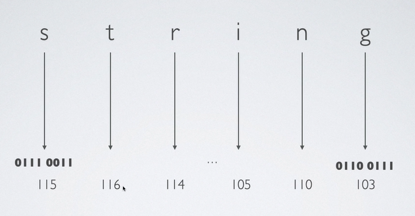
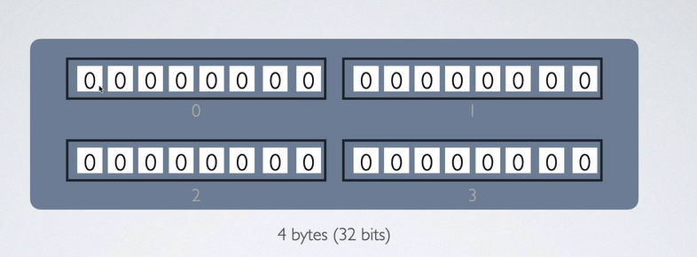

__Buffer in Node.js__
`Buffer is a Container in Memory`. It is very similer to array, means a data stracture. Means they have index also. 
A Buffer handles the binary data. The http or fs module uses buffers internally for network or file operations.
Network Request, I/O or file Reading and writting are all zeros and ones. Buffer helps node.js to deal with network requests.
send data to other processes. for database communication, buffer plays an important role. 

__prerequisite topic:__
1. Binary. 
2. Hexadecimal Numbers (base 16 numbers).
3. Character Sets/ Encoding.

1. Binary Numbers:
   1 byte = 8 bits

2. Hexadecimal Numbers (base 16 numbers):
    To identify a Hexadecimal Number = 0x <hex_number>
    Example: 0x456
    Explanation: 
    - 6 x 16^0 = 6
    - 5 x 16^1 = 80
    - 4 x 16^2 = 1024
    - 6 + 80 + 1024 = 1110 --> 0x456 
    - calculate fa3c = ?

    

    If the data size is too much large, we can use Hexadecimal data instead of Binary. 

3. Character Sets Encoding: Letters and symbols(charecters) that a writing system uses, and a representation of assigning different numbers
    to those characters.
    - Unicode : A standard for representing and encoding characters in most of the writing system worldwide.
    - ASCII : It defines 128 characters, lowercase and uppercase of letters a-z, numbers from 0-9, puntuations [$,!.@...]
    and some control characters like DEL (Delete) for English language

    `ASCII is a subset of UNICODE`

    Before Character encoding, We have to learn Encoder and Decoder. 
    - Encoder encodes data from meaningful to us to binary data
    - Decoder decodes the encoded data from binary to meaningful to us. 

    Character Encoding: A system of assigning a sequence of bytes (just some zeros and ones) to a character. The most common one is utf-8,
    defined by the Unicode standard, therefore its characters have the same numbers as the Unicode. 

    Lets consider a string = "string"
    UTF-8 : Unicode Transformation Format-8
    UTF-8 Will convert the first character s  to 0111 0011. You may ask why  "0111 0011" binary? because, UTF-8 will convert  each character
    to 8 bit. secondly the UNICODE of s is 115, and the binary of 115 is  0111 0011, therefore, if we use UTF-8 character encoding it will store "0111 0011" value in the memory. 

- Always Specify The Encoding System

__Buffer :__
As we said in the beginning of the document, buffer is similer to an Array. 

 

Inside a buffer, each index cosumes exactly 8 bits. Once you allocat the size of buffer it will never changed. If you try to 
insert 36 bits in a buffer, node.js will not allow to insert the last 4 bits inside the buffer. 