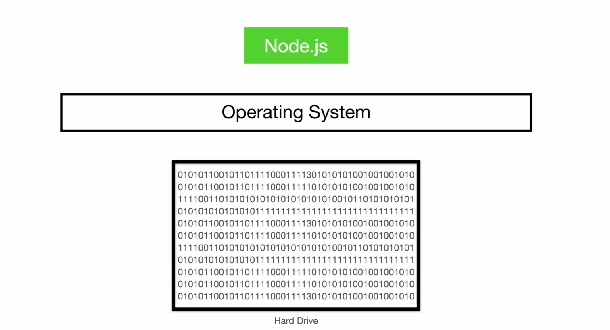

__File System__ 

What is File?  
File is a sequence of bits. It can be image file, video file or audio file, text file etc.


Everything inside your hard drive is a sequences of bits. One sequence of bits (0s' and 1s') may be video file.This video file contains Name of the file, access control to the user, location of the file where the user has stored it,
the type of the file like .mp4 or .txt or .jpg file etc. the timestaps can also be added inside that binary sequence as well. In software term Everything is file. OS, Desktop Applicaitons, video audio images, scripts everything is FILE! Even 
folder is also file.


Now the Point is How Node.js Deals with files ?!
Node.js use System calls by the Libuv to contact with operating system. One of method is open() in System calls. Using this open system calls, the operating system will go to that hard drive, get the binary code from the hard drive, and return it to operating systems, and finally the operating system return it to nodejs application. 

Whenever we want to write something to a file, that time node.js use rename() system calls by the libuv and it writes to the hard drive through operating systems.




__How Node.js deals with file?__ 

There are three different things to do exact same thing with the file:
1. Promises API (most clean )
2. Callback API (callback API is faster, and memory efficient than Pomises API)
3. Synchronous API (not to use it)


When you are writing something to a file, it will not save in your hard drive direcly, until you press Ctrl + S, it 
will be stored in memory. 


```javaScript
import {log} from "node:console"
import { Buffer } from "node:buffer"
import {open as fileOpenPromise} from "node:fs/promises"

class StreamBuffer{
    static BUFFER_CONSTANTS = Object.freeze({
        bufferOffset:0,
        bufferLength:10,
        bufferAllocationByte:10,
        bufferLength:10
    })
    constructor(filePath,operation,stringPosition){
        this.filePath = filePath
        this.operation = operation
        this.stringPosition = stringPosition
    }
    async FreeUpMemory(){

    }
    async readStreamByChunk(){
        let bufferData = "";
        try{
            while(true){
                let chunk = await this.readChunkData()
                if(chunk.bytesRead === 0)break;
                log(chunk.buffer)
                bufferData += chunk.buffer
                this.stringPosition += StreamBuffer.BUFFER_CONSTANTS.bufferLength
            }
            return bufferData
        }catch(error){
            return error.message;
        }
    }
    async readChunkData(){  
        let readFileHandle,buffer;
        try{
            readFileHandle = await fileOpenPromise(this.filePath,this.operation)
            // let fileSize = (await readFileHandle.stat()).size 
            const chunk = await readFileHandle.read({
                position: this.stringPosition,
                buffer: Buffer.alloc(StreamBuffer.BUFFER_CONSTANTS.bufferAllocationByte),
                offset :StreamBuffer.BUFFER_CONSTANTS.bufferOffset,
                length:StreamBuffer.BUFFER_CONSTANTS.bufferLength
            })
            return chunk 

        }catch(error){
            return error
        }finally{
            await readFileHandle.close()
            buffer = null
        }
    }
}

const chunkBuffer = new StreamBuffer("../public/files/input.txt",'r',0)
let bufferData = await chunkBuffer.readStreamByChunk()
log(bufferData)

```