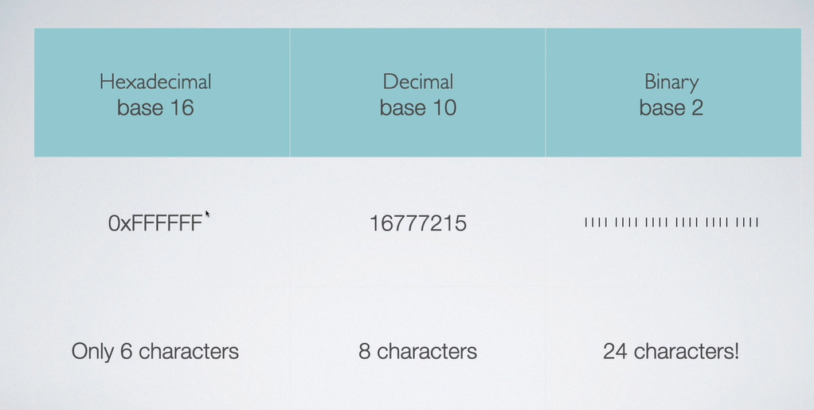

__Buffer in Node.js__
A Buffer handles the binary data. The http or fs module uses buffers internally for network or file operations.
Network Request, I/O or file Reading and writting are all zeros and ones. Buffer helps node.js to deal with network requests.
send data to other processes. for database communication, buffer plays an important role. 

__prerequisite topic:__
1. Binary. 
2. Hexadecimal Numbers (base 16 numbers).
3. Character Sets/ Encoding.

1. Binary Numbers:
   1 byte = 8 bits

2. Hexadecimal Numbers (base 16 numbers)
    To identify a Hexadecimal Number = 0x <hex_number>
    Example: 0x456
    Explanation: 
    6 x 16^0 = 6
    5 x 16^1 = 80
    4 x 16^2 = 1024
    6 + 80 + 1024 = 1110 --> 0x456 
    calculate fa3c = ?

    

    If the data size is too much large, we can use Hexadecimal data instead of Binary. 